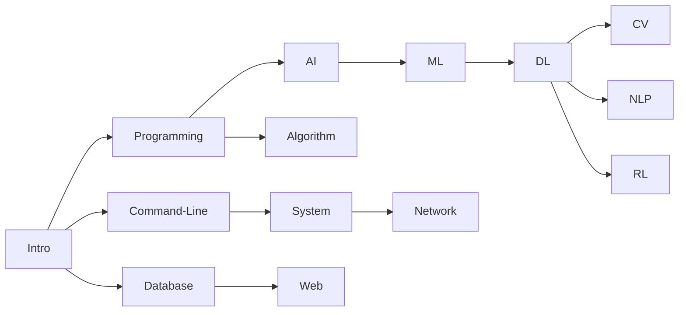

# Road Map

```mermaid
graph LR
Intro --> Programming --> AI --> ML --> DL --> CV & NLP & RL
Programming --> Algorithm
Intro --> Command-Line --> System --> Network
Intro --> Database --> Web
```

From 0 to 1, the road to learn CS with AI. 

<!-- [AI Road Map](ai_map.md) -->

<a href="#/ai_map.md" style="font-size:30px;font-weight:800;">AI Road Map</a>

 
 
 
 
 
 
